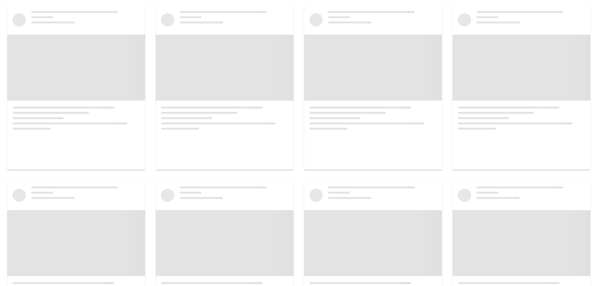
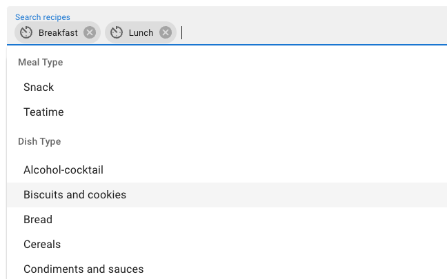
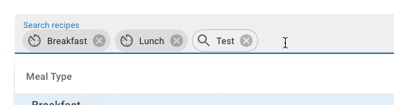

#Demo

# Implementation progress:

## Step 1

Add Redux for state management. This will help to store all data in one place and Search Box and List to be separated

## Step 2

Refactor existing effect into a Redux Thunk side effect `apps/recipe-search/src/app/store/features/recipes/fetchRecipesList.ts`

## Step 3

While list is loading it looks ugly and I added skeletons as loading state (using MUI components):

## Step 4

Use MUI tags for creating search query. Seems most practical to me because we can combine here different facets. Added all facets from documentation (`dishType`, `diet`, `mealType`,`health`, `cuisineType`) as categories in suggestions. You can multi-select them.

All free form text is inserted as separate chip. As you can have only one query, only last one is used:

`apps/recipe-search/src/app/search-box/search-box.tsx`

## Step 5

Add Next/Prev buttons. Wanted to add Pagination, but their API don't support skip/limit params.

Next Button was straightforward to add, but `Previous` was tricky one, because API returned only next page url.

As solution, I remember all next urls when you press Next, but when you press Back, I pop latest element, and using the remaining one. If on page 2 'Prev' is clicked, I just rerun initial query.

## Some mentions

`Debounce the inputs` task is not necessary here, because `Chips` method input executes query only on enter press
